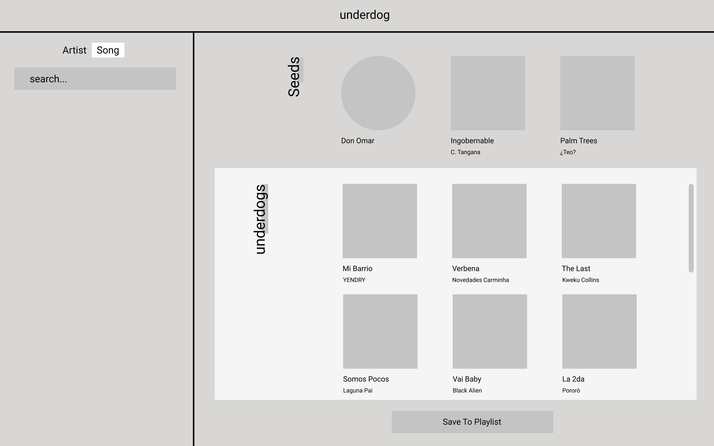

# Underdog Project

The project goal is to provide music recommendations of undiscovered music. It comes from the desire to find and listen to music that the mainstrams haven't picked up yet. It is a simple React Web App that connects to the spotify API for music data.

## Running the App

The app is currently being hosted through Heroku at: 
#### `https://underdog-app.herokuapp.com/`

## Using Underdog

1. First think of a song or artist you really like and type it in the search box in the left side.
2. Press enter or click on the "search" button and see the results come up below.
3. Chose the option that best matches your search and watch it be added to the upper part of the main app called "Seeds".
4. After this, you should see the recommended underdogs appear right below in a scrollable grid container. These "Underdogs" are recommended songs that are not very popular but are related to your seeds.
5. You may keep adding seeds (up to 3 seeds) and see the results keep piling up.
6. When all the seeds are placed, you may save a playlist to your spotify account by clicking the "Add to playlist" button at the bottom of the app.
7. Enjoy Underdog!
